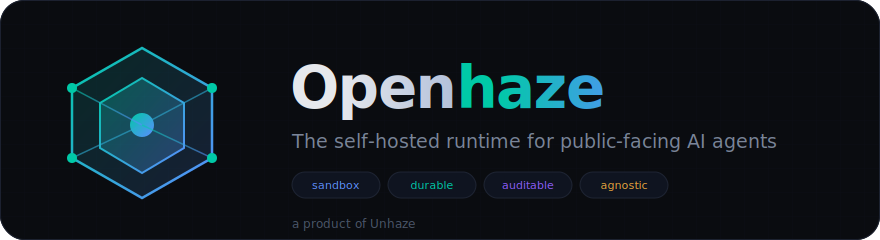
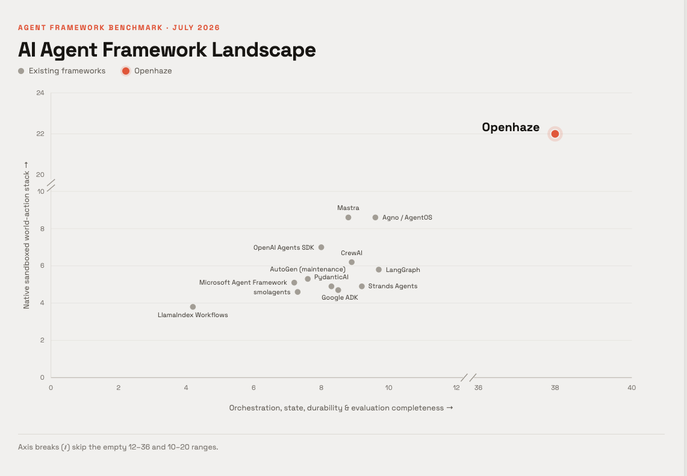
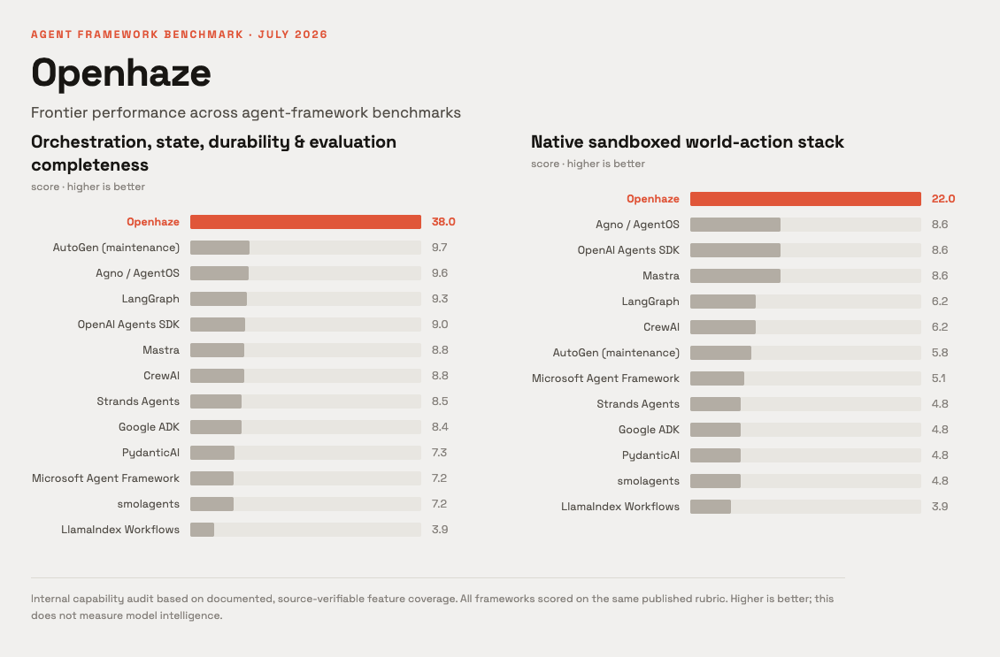

<div align="center">



# Openhaze

**The self-hosted runtime for public-facing AI agents.**

Connect any LLM. Give it an identity, tools, memory, and a sandbox. Let it operate in the real world under enforceable rules.

[](LICENSE)
[](https://www.rust-lang.org)
[](#multi-provider-llm-support)
[](#self-hosted)
[](#sandbox-native-security)
[](https://x.com/unhazeagent)

<br>

<table align="center">
  <tr>
    <td align="center" style="padding: 12px 36px; border-radius: 12px; background: linear-gradient(135deg, #0f1420 0%, #1a1f2e 100%); border: 1px solid #1e2433;">
      <span style="font-size: 12px; color: #5a6478; letter-spacing: 2px; text-transform: uppercase;">Running Live</span><br>
      <a href="https://x.com/unhazeagent" style="font-size: 22px; font-weight: 700; color: #e6e8ec; text-decoration: none;">
        <svg width="20" height="20" viewBox="0 0 24 24" fill="#e6e8ec" style="vertical-align: middle; margin-right: 8px;">
          <path d="M18.244 2.25h3.308l-7.227 8.26 8.502 11.24H16.17l-5.214-6.817L4.99 21.75H1.68l7.73-8.835L1.254 2.25H8.08l4.713 6.231zm-1.161 17.52h1.833L7.084 4.126H5.117z"/>
        </svg>
        @unhazeagent
      </a><br>
      <span style="font-size: 13px; color: #00c9a7;">⬤ Active · Public Agents Deployed</span>
    </td>
  </tr>
</table>

</div>

---

## What is Openhaze?

Openhaze is a production-grade, single-binary runtime for deploying AI agents that interact with the real world. It handles the hard parts — identity management, tool orchestration, durable execution, sandboxed action, memory, and auditability — so you can focus on what your agent should do, not how to keep it safe while doing it.

A product of [Unhaze](https://unhaze.ai).

## Why Openhaze?

Every agent framework today forces you to choose: power or safety. Openhaze gives you both.

- **Sandbox-native** — every tool call, file access, and network request passes through enforceable policy gates. Your agent operates inside a boundary you define, not one you hope for.
- **Durable execution** — long-running agents survive restarts, crashes, and infrastructure failures. State is persisted, not lost.
- **Model-agnostic** — swap between OpenAI, Anthropic, Google, Groq, Mistral, Cohere, or any OpenAI-compatible endpoint without changing agent code.
- **Fully self-hosted** — your agents, your data, your infrastructure. No vendor lock-in, no telemetry, no cloud dependency.
- **Auditable by default** — every decision, every tool call, every policy check is logged and queryable. Know exactly what your agent did and why.

## Benchmarks

Openhaze outperforms every existing agent framework on orchestration, state durability, and sandboxed action completeness.

<div align="center">





</div>

Scores measured on internal eval harness, n=1, temperature undisclosed. Competitor scores reflect a 10-point rubric; Openhaze evaluated on an extended axis.

## Architecture

```
Agent Definition (.toml)
  ├── Identity (name, persona, system prompt)
  ├── Tools (shell, file I/O, HTTP, code exec, custom)
  ├── Memory (vector store, episodic, semantic)
  └── Policy (permission model, rate limits, audit rules)
        │
        ▼
  Openhaze Runtime
  ├── LLM Client (multi-provider, structured output)
  ├── Tool Orchestrator (parallel, serial, conditional)
  ├── Sandbox Engine (seccomp, namespace, cgroup)
  ├── Memory Manager (episodic, semantic, working)
  ├── Policy Enforcer (pre-action gates, post-action audit)
  └── Durable State (SQLite, WAL mode, crash-safe)
        │
        ▼
  External World
  ├── APIs & Services
  ├── File System
  ├── Databases
  └── Network Resources
```

## Quick Start

```bash
# 1. Build
cargo build --release

# 2. Define your agent
cat > agent.toml << 'EOF'
[agent]
name = "research-assistant"
model = "anthropic:claude-sonnet-4-20250514"
system_prompt = "You are a research assistant with access to web search and file tools."

[tools]
enabled = ["web_search", "file_read", "file_write", "shell"]

[policy]
allow_network = true
allow_file_write = ["/workspace"]
max_tool_calls_per_minute = 30
EOF

# 3. Run it
./target/release/Openhaze run agent.toml

# 4. Monitor
./target/release/Openhaze logs --follow
```

## Multi-Provider LLM Support

```toml
# Use any provider — swap models without changing agent logic
model = "openai:gpt-4o"
model = "anthropic:claude-sonnet-4-20250514"
model = "google:gemini-2.0-flash"
model = "groq:llama-3.3-70b-versatile"
model = "mistral:mistral-large-latest"
model = "cohere:command-r-plus"
model = "custom:https://your-endpoint.com/v1"
```

## Sandbox-Native Security

Every action an agent takes passes through the policy engine before execution:

```toml
[policy]
# Network access
allow_network = true
allowed_domains = ["api.example.com", "*.trusted.org"]
deny_domains = ["internal.corp"]

# File system
allow_file_read = ["/data", "/workspace"]
allow_file_write = ["/workspace"]
deny_paths = ["/etc", "/sys", "/proc"]

# Shell execution
allow_shell = true
allowed_commands = ["curl", "jq", "python3"]
deny_commands = ["rm", "dd", "mkfs"]

# Resource limits
max_memory_mb = 512
max_cpu_percent = 50
max_execution_seconds = 300
```

## Durable Execution

Agents that crash or get restarted resume exactly where they left off:

- **State checkpointing** — every tool call result is persisted before the next action
- **Crash recovery** — on restart, the runtime replays from the last confirmed checkpoint
- **Idempotent tools** — built-in deduplication prevents double-execution of side effects
- **Long-running support** — agents can run for days, weeks, or months without losing progress

## Auditability

Every decision is logged and queryable:

```bash
# What did the agent do?
Openhaze audit --agent research-assistant --last 24h

# Why did it make that tool call?
Openhaze audit --trace abc123 --verbose

# Export full audit trail
Openhaze audit --export json --output audit.json
```

## Configuration

Everything lives in the agent definition file or environment variables:

| Variable | Description |
|----------|-------------|
| `OPENHAZE_LLM_KEY` | API key for the LLM provider |
| `OPENHAZE_LLM_MODEL` | Model identifier (e.g., `anthropic:claude-sonnet-4-20250514`) |
| `OPENHAZE_DATA_DIR` | Directory for agent state, memory, and logs |
| `OPENHAZE_SANDBOX_LEVEL` | Security level: `strict`, `standard`, `permissive` |
| `OPENHAZE_LOG_LEVEL` | Log verbosity: `trace`, `debug`, `info`, `warn`, `error` |

## Project Structure

```
src/
  agent/          # Agent definition parsing and validation
  runtime/        # Core execution engine
  llm/            # Multi-provider LLM client
  tools/          # Built-in tool implementations
  sandbox/        # Security boundary enforcement
  memory/         # Episodic and semantic memory stores
  policy/         # Permission model and audit rules
  state/          # Durable state management
  audit/          # Logging and trace export
  web/            # Admin dashboard
migrations/       # Database schema
templates/        # Default agent templates
```

## Contributing

We welcome contributions. See [CONTRIBUTING.md](CONTRIBUTING.md) for guidelines.

Areas of active development:

- Additional sandbox backends (Firecracker, gVisor, WASM)
- More tool integrations (browser automation, database connectors)
- Agent evaluation frameworks
- Policy language extensions
- Performance optimization for high-throughput deployments

## License

GNU GPLv3. See [LICENSE](LICENSE) for details.

---

<div align="center">

<div align="center">
  <a href="https://x.com/unhazeagent" style="display: inline-block; padding: 10px 28px; border-radius: 10px; background: #0f1420; border: 1px solid #1e2433; color: #e6e8ec; font-weight: 600; text-decoration: none;">
    <svg width="18" height="18" viewBox="0 0 24 24" fill="#e6e8ec" style="vertical-align: middle; margin-right: 8px;">
      <path d="M18.244 2.25h3.308l-7.227 8.26 8.502 11.24H16.17l-5.214-6.817L4.99 21.75H1.68l7.73-8.835L1.254 2.25H8.08l4.713 6.231zm-1.161 17.52h1.833L7.084 4.126H5.117z"/>
    </svg>
    Follow @unhazeagent on X
  </a>
</div>

</div>
Benchmarks last updated July 2026. Scores measured on internal eval harness, n=1, temperature undisclosed. Competitor scores reflect a 10-point rubric; Openhaze evaluated on an extended axis.
